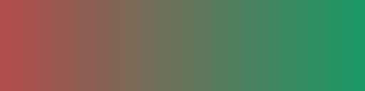
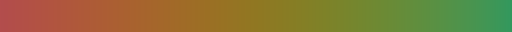
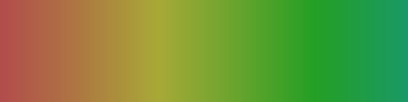
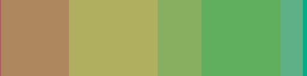
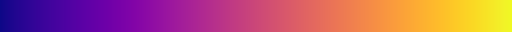
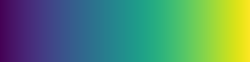
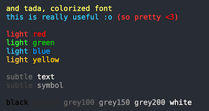
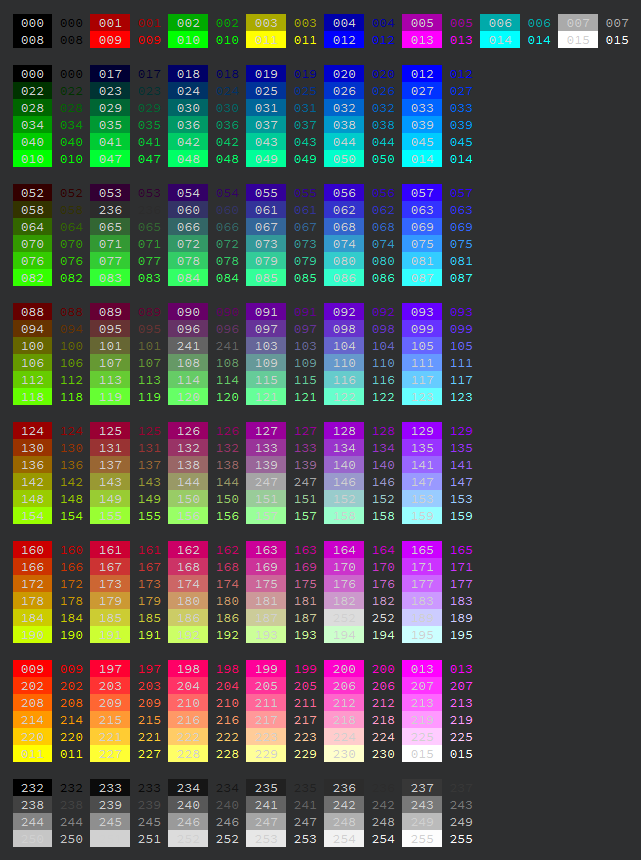
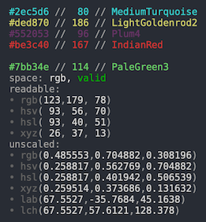
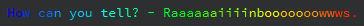

# vivid 🌈
A simple-to-use `cpp` color library

- **strongly-typed** colors
- safe color space **conversions**
- perceptual color **interpolation**
- popular and custom **color maps**
- **xterm** names and **ansi** codes
- ansi **escape sequences** and **html** encoding
- (somewhat™) **unit tested** in itself and against `QColor`
- **qmake** and **cmake** support

```cpp
using namespace vivid;

//  create and interpolate colors
Color c1( "indianred" );
Color c2( { 0.f, 0.4f, 0.5f }, Color::Space::Hsl );

auto interp = lerpLch( c1, c2, 0.5f );   //  perceptual interpolation in L*C*h(ab)
std::string hex = interp.hex();

//  quick access to popular colormaps for data visualization
ColorMap cmap( ColorMap::Preset::Viridis );
Color mid = cmap.at( 0.5f );

//  ansi and html encodings
std::cout << ansi::subtleText << "woah" << ansi::fg( c1 ) << "!!" << ansi::reset;
fout << html::bg( "#abc123" ) << "styled background color" << html::close;
```

##  Content

<!-- TOC depthFrom:2 depthTo:2 withLinks:1 updateOnSave:1 orderedList:0 -->

- [Content](#content)
- [Motivation](#motivation)
- [Getting Started](#getting-started)
- [Dependencies](#dependencies)
- [Types](#types)
- [Color Spaces](#color-spaces)
- [Interpolation](#interpolation)
- [Color Maps](#color-maps)
- [Encodings](#encodings)
- [Attributions](#attributions)

<!-- /TOC -->


## Motivation

Things we create should be beautiful. Be it a console log message or a real-time volumetric data plot. I'm working with colors quite often, but found the available means to work with them lacking. Especially if you want to just get stuff (he said stuff) done and your ideas down in code. Over time, I gathered all the little snippets and helpers I had created, and thus this project was born.

`vivid` allows you to quickly create, lookup and convert colors. It provides perceptual color interpolation, easy access to color names, ascii escape codes and to some of the great data visualization color palettes out there.


## Getting Started

```bash
git clone git@github.com:gurki/vivid.git
git submodule update --init
```

This repository comes with support for both `qmake` (_vivid.pri_) and `cmake` projects.
You can try it out by simply opening up `examples/qmake/vivid.pro` in `Qt Creator`, or running

```bash
mkdir build && cd build
cmake .. && make
./examples/cmake/vivid_example
```


## Dependencies

`vivid`  depends on a small number of header-only libraries, which are mostly included as submodules.

- Nlohmann's great [Json for Modern C++](https://github.com/nlohmann/json) to load color names and color maps
- [OpenGL Mathematics (GLM)](https://github.com/g-truc/glm) for vector type and operations
- [Catch2](https://github.com/catchorg/Catch2/tree/master/examples) for testing


## Types

`vivid` provides a convenient high-level `Color` class, which is intended to be flexible and easy to use. It stores the `value` (_col_t_) and its associated `space` _∈ {`RGB`, `HSV`, `HSL`, `LCH`}_ of the underlying type. `Colors` can be implicitly constructed from any of above native color spaces and their representations (c.f. _include/vivid/color.h_).

```cpp
//  instantiation
Color col1( "#abcdef" );
Color col2 = { 255, 0, 128 };
Color col3 = { { 1.f, 0.3f, 0.6f }, Color::SpaceHsl };
```

Conversions to other color spaces are directly available using e.g. `col.hsl()` or `col.hex()`. Moving to one of the four native spaces will return another `Color` instance with its `value` converted and `space` set accordingly.

```cpp
//  native conversion
Color conv = col1.hsl();    //  convert to hsl, whatever the current space
col1.spaceInfo();   //  rgb
conv.spaceInfo();   //  hsl
```

`8-bit` colors are represented using either byte-triplets (_col8_t_) or compactly as `ARGB` (_uint32_t_), where alpha is set to `0xff` by default. Lossy conversion, e.g. getting the name or index of some non-xterm color, will return the closest valid color/value in that space.

```cpp
//  lossy conversion
Color original( "#a1b2c3" );
Color lossy = original.index(); //  clamps to nearest ansi color code
original.hex(); //  #a1b2c3
lossy.hex();    //  #afafd7
```

### Strong Typing

Under the hood, `vivid` uses _inheritance-based strong typing_. This means, that the compiler will give you a heads-up if e.g. you're trying to convert from the wrong color. This also enables `Colors` to be implicitly initialized from the native spaces.

```cpp
//  type-safe conversions
rgb_t col1 = { 1.f, 0.f, 0.4f };
hsl_t col2 = hsl::fromHsv( col1 );
//  [...] error: no viable conversion from 'vivid::rgb_t' to 'const vivid::hsv_t'

//  implicit initialization from native spaces
Color col3 = lch_t( 93.f, 104.5f, 272.3f );
Color col4 = xyz_t( 0.f, 0.f, 1.f );
//  [...] error: no viable conversion from 'vivid::xyz_t' to 'vivid::Color'
```

If need be, you can always explicitly cast `col_t` to other spaces. This simplifies color handling and allows for some flexibility, but also introduces the risk of manually circumventing the type system, so use with care.

```cpp
//  explicit type casts
auto srgb = srgb_t( col1 ); //  init child from parent

glm::vec3 src = { 0, 1, 0 };
auto xyz = static_cast<xyz_t>( src );   //  init from external source
```

### Color Math

The base type _col_t_ aliases directly to _glm::vec<3, float>_ (c.f. _include/vivid/types.h_). This allows effective and efficient use of colors, providing all of `glm`'s vector goodness right out of the box.

<details><summary>Click to expand example</summary><p>

```cpp
//  some uses of _glm_ in _vivid_

rgb_t saturate( const rgb_t& rgb ) {
    return glm::clamp( rgb, 0.f, 1.f );
}

inline glm::mat3 workingSpaceMatrix( ... ) {
    //  ...
    const glm::vec3 S = glm::inverse( K ) * XYZ;
    return K * glm::diagonal3x3( S );
}

```

</p></details>


## Color Spaces

Under the hood, `vivid` uses an extensive set of strongly-typed conversions between color spaces (c.f. _include/vivid/conversion.h_). All of these methods are built in a functional way, where colors get passed through converters, yielding new colors in different spaces. The following direct conversions are currently available.

    adobe ← xyz
    hex ← rgb8
    hsl ← rgb
    hsv ← rgb
    index ← name, rgb8
    lab ← lch, xyz
    lch ← lab
    lrgb ← srgb
    name ← index
    rgb ← hsl, hsv, rgb8
    rgb32 ← hex, rgb
    rgb8 ← rgb, rgb32
    srgb ← index, lrgb, xyz
    xyz ← adobe, lab, srgb


### Working Spaces

    Note: You can use this library as high- or low-level as you like!

<details><summary>Click to expand section</summary><p>

The `Color` class assumes a default `sRGB` working space. Specifically, the conversion between `RGB` and `XYZ` applies `sRGB` compounding and inverse compounding. You can however extend this freely and work with custom color spaces using the low-level API. If you have no idea what I just said, don't worry - I didn't either a couple weeks ago :).

```cpp
//  manual wide-gamut rgb to xyz conversion

rgb_t wg = { 1.f, 0.f, 0.f };

//  working space matrix from primary color chromaticities and white point
const glm::vec3 ciex = { 0.7347f, 0.1152f, 0.1566f };
const glm::vec3 ciey = { 0.2653f, 0.8264f, 0.0177f };
const auto wg_to_xyz = workingSpaceMatrix( profiles::xy_d50, ciex, ciey );

//  linearized rgb via inverse gamma compounding
const float gamma = 2.19921875f;
auto linear = rgb::gamma( wg, gamma );

//  xyz with d50 white point using above linear transformation
auto xyz50 = xyz_t( wg_to_xyz * linear );

//  xyz with d65 white point via chromatic adaptation
auto xyz65 = chromaticAdaptation( xyz50, profiles::xy_d50, profiles::xy_d65 );
```

Note that `vivid` uses the _D65_ white point and _2° Standard Observer_, which is why we apply chromatic adaptation in the example above. This let's us subsequently use e.g. `srgb::fromXyz( xyz65 )`.

</p></details>


## Interpolation

```cpp
//  pseudo-code to generate the images in this section
for ( auto& pixel : image ) {
    const float t = pixel.x / image.width;
    const Color col = lerpLch( c1, c2, t );
    image.setColor( pixel, col );
}
```

Color interpolation is an interesting topic. What should the color halfway in-between <span style="color:rgb(178, 76, 76)">red</span> and <span style="color:rgb(25, 153, 102)">green</span> look like? There is a great article introducing this topic by Grego Aisch [^1]. In order to do a perceptually linear transition from one color to another, we can't simply linearly interpolate two `RGB`-vectors. Rather, we move to a more suitable color space, interpolate there, and then move back again. Namely, we use the `CIE L*C*h(ab)` space, or `LCH`, which matches the human visual system rather well. There are more suitable color spaces nowadays to do so, but `LCH` has a nice balance between complexity (code and computation) and outcome.

Compare the following table to get an idea of interpolating in different color spaces.

Color Space   | Linear Interpolation
--------------|-------------------------------------------------------------------
RGB           | 
LCH           | 
HSV           | 
HSL (Clamped) | 

`vivid` provides color interpolations in the four main spaces `RGB`, `HSL`, `HSV`, `LCH`. They can be accessed directly via e.g. `lch_t::lerp( const lch_t&, const lch_t&, const float )`, or more conveniently via e.g. `lerpLch( const Color&, const Color&, const float )`.

[\^1] [Grego Aisch (2011) - How To Avoid Equidistant HSV Colors](https://www.vis4.net/blog/2011/12/avoid-equidistant-hsv-colors/)


## Color Maps

`vivid` comes with a set of pre-defined color maps, which I conveniently gathered under one umbrella. Thanks to the awesome community out there for their great work! [\^2,\^3]
As shown in the example in the beginning, it's quick and easy to query colors from a certain color map. You can also create your own maps by simply loading an according _\*.json_ file.

```cpp
//  loading a custom color map
ColorMap cmap( "res/colormaps/mycolormap.json" );
auto mid = cmap.at( 0.5f );
```

Name        | Image
------------|----------------------------------------------------
Inferno     | 
Magma       | 
Plasma      | 
Viridis     | 
Vivid       | 
Rainbow     | 
Hsl         | 
Hsl Pastel  | 
Blue-Yellow | 
Cool-Warm   | 

[\^2] [Stefan & Nathaniel - MPL Colormaps](http://bids.github.io/colormap/) <br>
[\^3] [SciVisColor](https://sciviscolor.org/)


## Encodings

`vivid` provides encodings for **ansi** escape codes (pretty console <3) and **html** using spans.

### Console

You can colorize console messages using the `ansi::fg()` and `ansi::bg()` helpers, or using one of the pre-defined constants, e.g. `ansi::white`. There's also a hand-picked set of the most useful™ and some of my favorite colors in there for you! You can take a look via `ansi::printColorPresets()`. Note, that for all of those your console must support `8-bit` colors, which however almost all modern consoles do.

<details><summary>Click to expand example</summary><p>

```cpp
std::cout << ansi::fg( 228 )  << "and tada, colorized font ";
std::cout << ansi::lightRed << "(so pretty " << ansi::red << "<3" << ansi::lightRed << ") \n\n";
std::cout << ansi::reset;  //  resets all formatting, i.e. white font, no backgorund
ansi::printColorPresets();
```



</p></details>

To get an overview of all available xterm colors and associated codes or quickly check if your console has 8-bit color support, you can call `ansi::printColorTable()` (shoutout to Gawin [^4] for the layout idea).



### Debugging

`vivid` in fact makes use of colored output itself! Any `Color` can be debugged using a one-line `Color::quickInfo()` or the more extensive `Color::info()`.



`ColorMaps` can also be quickly visualized directly in the terminal, or used to create some joyful text effects.

```cpp
ColorMap rainbowMap( ColorMap::Preset::Rainbow );
std::string text = "How can you tell? - Raaaaaaiiiinbooooooowwws.";
std::cout << ansi::colorize( text, rainbowMap ) << std::endl;
```



### HTML

One of my side projects is a tagged logging system, where one of the sinks goes to html. This has become very handy.

```cpp
Color col( "LightSteelBlue" );
fout << html::fg( col ) << "colorized html text!" << html::close;
//  <span style='color:rgb(175, 175, 255)'>colorized html text!</span>
```

[^4] [Gawin's xterm color demo](https://github.com/gawin/bash-colors-256)


## Attributions

Massive thanks to all the colour enthusiasts out there for references and material, without which this project would not have been possible.
Shoutout and thanks to the community over at [r/cpp](https://www.reddit.com/r/cpp/comments/bpu0hl/vivid_a_simpletouse_cpp_color_library) for comments, feedback and suggestions! <3
